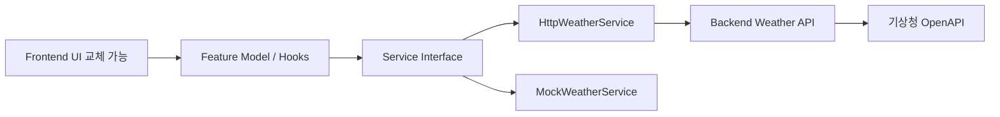

# 프론트엔드·백엔드 아키텍처 및 책임 경계

## 목표

프론트엔드 디자인팀이 화면을 대폭 교체해도 상태·데이터·백엔드 연동을 최대한 건드리지 않도록 한다.



## Repository

권장:
```text
gwinong-frontend
gwinong-backend
```

## Frontend 책임

- 화면/입력
- local profile
- navigation
- Backend API client
- loading/error/fallback
- demo fixtures

금지:
- 기상청 직접 호출
- API key
- 기상 데이터 해석
- 실제 정책 자격판정
- OCR/AI 계약 판정

권장 구조:

```text
src/
├─ domain/
├─ stores/
├─ services/
├─ fixtures/
├─ features/
│  ├─ onboarding/model + ui
│  ├─ home/model + ui
│  └─ weather/model + ui
└─ pages/
```

View에서 직접 fetch하지 않는다.

## Backend 책임

v1:
- Weather endpoint
- API key 보호
- KMA base date/time 선택
- 지역 → KMA grid
- raw response normalize
- timeout/error
- fixture fallback

권장:

```text
supabase/functions/
├─ weather-api/index.ts
└─ _shared/weather/
   ├─ domain.ts
   ├─ application.ts
   ├─ location-resolver.ts
   ├─ kma-forecast.adapter.ts
   ├─ normalizer.ts
   └─ fixture.ts
```

## 교체 경계

디자인팀 자유 변경:
```text
features/*/ui/
pages/
styles/
assets/
```

기능 계약 영역:
```text
domain/
stores/
services/
fixtures/
features/*/model/
```

## 실패 전략

```text
KMA 성공 → live=true
KMA 실패 → fixture fallback → live=false → UI에 데모 표시
```

## 과도한 아키텍처 금지

DB/Auth/CQRS/Event Bus/범용 DI/LLM abstraction을 도입하지 않는다.
